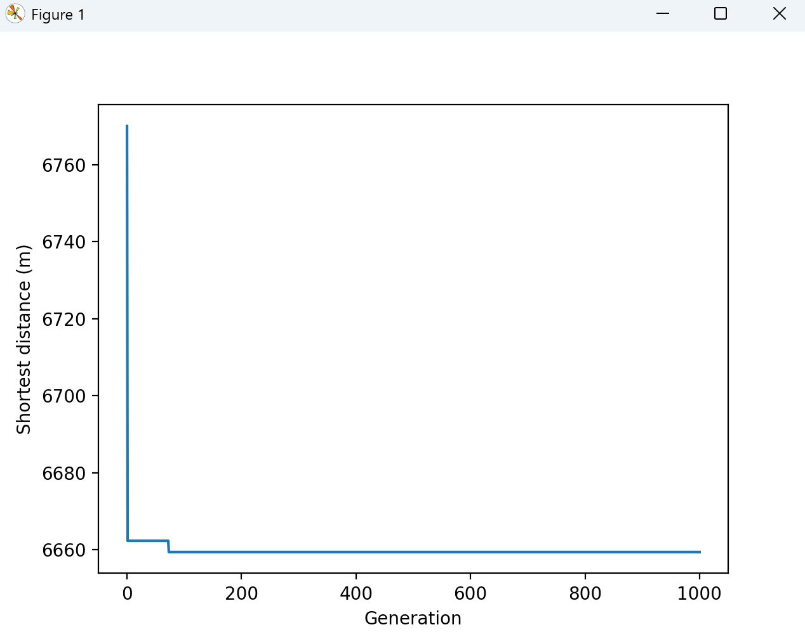

# 一、实验题目

利用遗传算法求解 TSP 问题

在National Traveling Salesman Problems (uwaterloo.ca) （https://www.math.uwaterloo.ca/tsp/world/countries.html）中任选两个TSP问题的数据集。


# 二、实验内容

## 1.算法原理

### 1.1 解的表示

n对于n个城市的TSP问题，解表示为1~n的排列

例如：10个城市的染色体表示为 [1,3,8,6,7,9,2,4,5,10]

对应的环游顺序：1->3->8->6->7->9->2->4->5->10->1


### 1.2 选择

#### 1.2.1 锦标赛选择

思想：模拟自然界中个体间的竞争，每次从种群中随机选取 *k* 个个体进行“锦标赛”，适应度最高的个体胜出。

步骤：

1. 在种群中随机选择k个个体
2. 在k个个体中，选择适应度最优的个体作为父代


#### 1.2.2 轮盘赌选择

思想：按适应度比例分配选择概率，适应度高的个体有更大几率被选中。

步骤：

1.计算每个个体的选择概率
$$
p_i=\frac{f_i}{\sum_{i=1}^{n}{f_i}}
$$
2.计算累积概率分布

3.生成1个0~1的随机数，根据随机数落在哪个累积概率区间，来选择个体


### 1.3 交叉

#### 1.3.1 联合随机映射(PMX)


#### 1.3.2 顺序映射(OX)


### 1.4 变异

#### 1.4.1 倒置变异


#### 1.4.2 交换变异

随机选取两个下标，把这两个下标对应位置的元素互换


### 1.5 算法流程

1. 先初始化种群
2. 计算初始化种群的路径长度，并记录当代种群中的最优解
3. 选择
4. 交叉
5. 变异
6. 计算新的种群的路径长度，并记录当代种群中的最优解
7. 重复执行以上步骤3~6指定的次数
8. 最后输出最优解


## 2.关键代码展示

### 2.1 初始化种群

#### 2.1.1 贪心算法初始化

利用贪心算法初始化解，能够提高初始种群的质量，从而提高收敛速度

```python
def greedy_init(self, start_city=0):
    # 贪心算法初始化
    path = [start_city]
    unvisited = set(range(self.city_num)) - {start_city}
    while unvisited:
        current = path[-1]
        next_city = min(unvisited, key=lambda x: self.dist_matrix[current, x])
        path.append(next_city)
        unvisited.remove(next_city)
    return path
```


#### 2.1.2 随机初始化

随机初始化种群，可以提高种群的多样性

```python
def random_init(self):
    # 初始化种群
    chromosome = np.random.permutation(self.city_num)
    return chromosome
```


#### 2.1.3 贪心+随机初始化

为了提高初始种群的质量，同时也为了保证多样性，将上述的贪心初始化和随机初始化按一定比例相结合。

```python
def init_pops(self):
    # 贪心初始化解
    greedy_num = int(self.pop_num * self.greedy_init_percent)
    for i in range(greedy_num):
        # 随机选择一个开始城市
        start_city = np.random.randint(0, self.city_num)
        # 调用贪心算法
        self.pops[i, :] = self.greedy_init(start_city)

    # 剩余种群随机生成
    for i in range(greedy_num, self.pop_num):
        self.pops[i, :] = self.random_init()
```


### 2.2 目标函数

以路径的总距离为目标函数

```python
def cal_one_path_total_dist(self,one_path):
    # 计算一条路径的距离
    total_dist=0
    for i in range(self.city_num-1):
        total_dist+=self.dist_matrix[one_path[i],one_path[i+1]]
    total_dist+=self.dist_matrix[one_path[-1],one_path[0]]
    return total_dist

def cal_total_dist(self):
    # 计算所有路径的总路径长度
    for i in range(self.pop_num):
        self.total_dist[i]=self.cal_one_path_total_dist(self.pops[i,:])

    # 记录最短路径和对应的最优种群
    shortest_dist_value=min(self.total_dist)
    self.shortest_dist.append(shortest_dist_value)

    shortest_dist_idx=np.argmin(self.total_dist)
    shortest_dist_path=self.pops[shortest_dist_idx,:]
    self.best_pops.append(shortest_dist_path)
    return shortest_dist_value,shortest_dist_path
```


### 2.3 适应度

以***目标函数的倒数***为适应度

```python
def cal_fitness(self):
    '''计算适应度
    适应度=1/总路径长度
    '''
    fitness = np.zeros(self.pop_num)
    for i in range(self.pop_num):
        fitness[i] = 1 / self.total_dist[i]
    return fitness
```


### 2.4 选择

#### 2.4.1 轮盘赌选择方法

缺点：容易**早熟**，在实验发现确实如此

```python
def seletion_roulette(self,fitness):
    '''轮盘赌选择
    缺点：容易早熟,实验表明确实如此
    '''
    fitness_sum=np.sum(fitness)
    prob=[item/fitness_sum for item in fitness]
    prob=np.array(prob)
    prob_cumsum=np.cumsum(prob)

    # 生成两个0~1之间的随机数
    parents= []  # 存储父母
    for i in range(2):  # 生成随机数来进行轮盘赌，确定父母
        rand_num=random.uniform(0,1)

        # 看这个随机数落在哪里
        for j in range(len(prob_cumsum)):
            if j==0:
                if rand_num<prob_cumsum[0]:
                    parents.append(self.pops[j,:])
            else:
                if prob_cumsum[j-1]<=rand_num and rand_num<prob_cumsum[j]:
                    parents.append(self.pops[j])
    return parents
```


#### 2.4.2 锦标赛选择

实验发现，此方法效果较好

```python
def selection_tournament(self,k=3):
    '''锦标赛选择
    效果较好'''
    candidates=np.random.choice(self.pop_num,k)
    winner=candidates[np.argmin(self.total_dist[candidates])]
    return self.pops[winner]
```


#### 2.4.3 选择方法的选择

`selection_mod`有2个取值：

- 1：轮盘赌选择
- 0：锦标赛选择（默认）

```python
def selection(self, fitness):
    if self.selection_mod == 1:
        # 轮盘赌选择
        parents = self.seletion_roulette(fitness)
    else:
        # 锦标赛选择
        parents = []
        parents.append(self.selection_tournament())
        parents.append(self.selection_tournament())
    return parents
```


### 2.5 交叉

我实现了顺序交叉和部分映射交叉，实验发现，两种方法的效果相差不大

#### 2.5.1 顺序交叉（OX）

```python
def crossover_OX(self, parents):
    # 顺序交叉（OX）
    parent1, parent2 = parents[0], parents[1]
    size = len(parent1)
    # 生成交叉点
    index1, index2 = sorted(np.random.choice(size, 2, replace=False))
    # 从 parent2 中截取片段
    sec2 = parent2[index1:index2]
    # 构建子代1：保留 parent1 中不在 sec2 的部分，插入 sec2
    mask = np.isin(parent1, sec2, invert=True)
    remaining = parent1[mask]
    son1 = np.concatenate([remaining[:index1], sec2, remaining[index1:]])
    # 构建子代2
    sec1 = parent1[index1:index2]
    mask = np.isin(parent2, sec1, invert=True)
    remaining = parent2[mask]
    son2 = np.concatenate([remaining[:index1], sec1, remaining[index1:]])
    return son1, son2
```


#### 2.5.2 部分映射交叉(PMX)

```python
 def crossover_PMX(self,parents):
        # 部分映射交叉(PMX)
        parent1, parent2 = parents[0], parents[1]
        size = len(parent1)
        # 1. 随机选择两个交叉点
        index1, index2 = sorted(np.random.choice(size, 2, replace=False))

        # 2. 初始化子代
        son1 = np.full(size, -1, dtype=int)
        son2 = np.full(size, -1, dtype=int)

        # 3. 交换中间片段
        son1[index1:index2] = parent2[index1:index2]
        son2[index1:index2] = parent1[index1:index2]

        # 4. 建立映射关系
        mapping1 = {parent2[i]: parent1[i] for i in range(index1, index2)}
        mapping2 = {parent1[i]: parent2[i] for i in range(index1, index2)}

        # 5. 填充子代剩余位置
        for i in list(range(0, index1)) + list(range(index2, size)):
            # 处理 son1
            value = parent1[i]
            while value in son1[index1:index2]:  # 如果值已存在于中间片段
                value = mapping1[value]  # 根据映射替换
            son1[i] = value

            # 处理 son2
            value = parent2[i]
            while value in son2[index1:index2]:
                value = mapping2[value]
            son2[i] = value

        return son1, son2

```


#### 2.5.3 交叉方法选择

`crossover_mod`有2个取值：

- 1：部分映射交叉
- 0：顺序交叉（默认）

```python
def crossover(self, parents):
    if self.crossover_mod==1:
        # 部分映射交叉
        son1, son2 = self.crossover_PMX(parents)
    else:
        # 顺序交叉
        son1, son2 = self.crossover_OX(parents)
    return son1, son2
```


### 2.6 变异

#### 2.6.1 交换变异

生成两个1~city_num之间的随机整数，分别代表城市的下标，且保证不相等，然后交换这两个下标的城市编号

```python
def mutation_swap(self):
    '''
    交换变异
    生成两个1~city_num之间的随机整数，分别代表城市的下标，
    且保证不相等
    然后交换这两个下标的城市编号
    :return:
    '''
    for i in range(self.pop_num):
        rate=random.uniform(0,1)
        if rate>self.mutation_rate:
            # 如果随机数大于变异概率，则不变异
            continue

        index1=random.randint(0,self.city_num-1) # 注意：右边的值也能取到，所以是要-1
        index2=random.randint(0,self.city_num-1)
        # 保证两个下标不相等
        while(index1 == index2):
            index2 = random.randint(0, self.city_num-1)

        # 交换
        self.pops[i,index1],self.pops[i, index2]=self.pops[i,index2],self.pops[i, index1]

```


#### 2.6.2 倒置变异

随机选择一段路径并反转顺序

```python
def mutation_inverse(self):
    '''倒置变异
    随机选择一段路径并反转顺序
    :return:
    '''
    for i in range(self.pop_num):
        rate=random.uniform(0,1)
        if rate>self.mutation_rate:
            # 如果随机数大于变异概率，则不变异
            continue

        # 生成两个不同的随机索引（范围0~city_num-1），并按升序排列
        index1,index2=sorted(np.random.choice(self.city_num,2,replace=False))
        self.pops[index1:index2]=self.pops[index1:index2][::-1]

```


#### 2.6.3 2-opt算法

通过交换路径中的两个边来缩短总距离，有利于加快算法收敛

实验发现，该方法非常有效

```python
def two_opt(self, path):
    '''2-opt算法
    效果较好
    '''
    improved = True
    while improved:
        improved = False
        for i in range(1, len(path) - 2):
            for j in range(i + 1, len(path)):
                if j - i == 1:
                    # 已经相邻的两个城市不需要交换，因为即使交换了也没有变化
                    continue
                # 计算交换后的距离变化
                old_dist = (self.dist_matrix[path[i - 1], path[i]] +
                            self.dist_matrix[path[j - 1], path[j]])
                new_dist = (self.dist_matrix[path[i - 1], path[j - 1]] +
                            self.dist_matrix[path[i], path[j]])
                if new_dist < old_dist:
                    path[i:j] = path[j - 1:i - 1:-1]  # 反转片段
                    improved = True
    return path
```


#### 2.6.4 变异方法的选择

`mutation_mod`有3个取值：

- 0：倒置变异+交换变异（默认）
- 1：倒置变异
- 2：交换变异

```python
def mutation(self,t):
    if self.mutation_mod==1:
        self.mutation_inverse()
    elif self.mutation_mod==2:
        self.mutation_swap()
    else:
        self.mutation_inverse()
        if t % (self.generation_num // 20) == 0:
            self.mutation_swap()

    if t%(self.generation_num // 20)==0:
        # 每隔一段时间进行一次2-opt算法优化
        for i in range(self.pop_num):
            self.pops[i]=self.two_opt(self.pops[i])
```


### 2.7 选择和交叉

利用精英保留的思想，保留总路径长度最短的前 10% 的精英个体

```python
def selection_crossover(self):
    # 先计算适应度
    fitness = self.cal_fitness()
    new_pops=[]
    # 保留前 10% 的精英个体
    elite_num = int(self.pop_num * 0.10)
    elite_indices = np.argsort(self.total_dist)[:elite_num]
    for i in elite_indices:
        new_pops.append(self.pops[i])

    # 生成剩余个体
    for i in range((self.pop_num - elite_num) // 2):
        # 选择
        parents = self.selection(fitness)
        # 交叉
        son1, son2 = self.crossover(parents)

        new_pops.append(son1)
        new_pops.append(son2)

    self.pops = np.array(new_pops)

```


### 2.8 遗传算法主函数

主函数运行流程

1. 先初始化种群
2. 计算初始化种群的路径长度，并记录当代种群中的最优解
3. 选择
4. 交叉
5. 变异
6. 计算新的种群的路径长度，并记录当代种群中的最优解
7. 重复执行以上步骤3~6指定的次数
8. 最后输出最优解

```python
def solve_GA(self):
    self.init_pops()  # 初始化种群
    print("--------初代--------")
    shortest_dist_value, shortest_dist_path = self.cal_total_dist()
    print("初代最短路径长度：", shortest_dist_value)
    print("初代最短路径:", shortest_dist_path)

    # 主循环，迭代
    for t in range(self.generation_num):
        print(f"----------第{t+1}次迭代----------")
        # 选择、交叉
        self.selection_crossover()
        # 变异
        self.mutation(t)

        shortest_dist_value,shortest_dist_path=self.cal_total_dist()
        print(f"第{t+1}代最短路径长度：", shortest_dist_value)
        print(f"第{t+1}代最短路径:", shortest_dist_path)

    shortest_dist_value,shortest_dist_path=self.choose_best()
    print("最短路径长度：",shortest_dist_value)
    print("最短路径：", shortest_dist_path)
    self.print_shortest_dist_path(shortest_dist_path)

    # 绘制优化过程图
    self.draw_shortest_dist_value_by_generation()
    # 绘制最短路径
    self.draw_path(shortest_dist_path)
```


## 3.创新点

### 3.1 贪心+随机初始化

为了**提高初始种群的质量**，同时也为了**保证种群多样性**，将上述的贪心初始化和随机初始化**按一定比例**相结合。

```python
def init_pops(self):
    # 贪心初始化解
    greedy_num = int(self.pop_num * self.greedy_init_percent)
    for i in range(greedy_num):
        # 随机选择一个开始城市
        start_city = np.random.randint(0, self.city_num)
        # 调用贪心算法
        self.pops[i, :] = self.greedy_init(start_city)

    # 剩余种群随机生成
    for i in range(greedy_num, self.pop_num):
        self.pops[i, :] = self.random_init()
```


### 3.2 倒置变异+交换变异

在实验中发现：

交换变异能够对路径中城市的顺序进行**局部调整**。单纯利用交换变异，难以找到最优解，需要较大的种群和较大的迭代次数才有可能找到最优解。

倒置变异是将某个片段进行反转，通常是比较大的调整。单纯利用倒置变异，容易陷入局部最优解。


因此，我将二者相结合

每一代都进行倒置变异，每隔几代就进行一次交换变异。从而避免陷入局部最优解。

```python
self.mutation_inverse()
if t % (self.generation_num // 20) == 0:
    self.mutation_swap()
```


### 3.3 2-opt算法

作用：通过交换路径中的两个边来缩短总距离。能够加快算法收敛。

使用时机：每隔几代使用1次2-opt算法进行优化

```python
def two_opt(self, path):
    '''2-opt算法
    效果较好
    '''
    improved = True
    while improved:
        improved = False
        for i in range(1, len(path) - 2):
            for j in range(i + 1, len(path)):
                if j - i == 1:
                    # 已经相邻的两个城市不需要交换，因为即使交换了也没有变化
                    continue
                # 计算交换后的距离变化
                old_dist = (self.dist_matrix[path[i - 1], path[i]] +
                            self.dist_matrix[path[j - 1], path[j]])
                new_dist = (self.dist_matrix[path[i - 1], path[j - 1]] +
                            self.dist_matrix[path[i], path[j]])
                if new_dist < old_dist:
                    path[i:j] = path[j - 1:i - 1:-1]  # 反转片段
                    improved = True
    return path
```


## 4.完整代码

```python
import numpy as np
import matplotlib.pyplot as plt
import random

# 读取tsp文件
def read_tsp_file(file_path):
    city_coord=[]
    reading_coords = False

    with open(file_path, 'r') as file:
        for line in file:
            line = line.strip()

            # 跳过空行和注释
            if not line:
                continue

            # 开始读取坐标部分
            if line.startswith("NODE_COORD_SECTION"):
                reading_coords = True
                continue

            # 结束读取
            if line == "EOF":
                break

            # 读取坐标数据
            if reading_coords:
                parts = line.split()
                if len(parts) >= 3:
                    city_id = int(parts[0])
                    x = float(parts[1])
                    y = float(parts[2])
                    city_coord.append({"id": city_id, "x": x, "y": y})

    return city_coord

class GA:
    def __init__(self,city_coord,
                 pop_num=100,
                 generation_num=100,
                 greedy_init_percent=0.20,
                 mutation_rate=0.95,
                 selection_mod=0,
                 crossover_mod=0,
                 mutation_mod=0):
        # TSP问题参数
        self.city_num=len(city_coord)
        self.city_coord=city_coord
        # 预计算所有城市之间的距离，降低计算时间
        self.dist_matrix=self.cal_dist_matrix()

        # 遗传算法参数
        self.pop_num=pop_num  # 种群数量
        self.generation_num=generation_num  # 迭代次数
        self.mutation_rate=mutation_rate    # 最大变异概率

        self.greedy_init_percent=greedy_init_percent  # 用贪心算法生成初始解的占比

        # 方法选择
        self.selection_mod = selection_mod  # 选择的方法。默认值为0，表示锦标赛选择法
        self.crossover_mod = crossover_mod  # 交叉的方法。默认值为0，表示顺序交叉法
        self.mutation_mod = mutation_mod    # 变异的方法。默认值为0，表示混合变异法

        # 数据存储
        self.pops=np.zeros((self.pop_num,self.city_num),dtype=int)   # 种群列表
        self.total_dist = np.zeros(self.pop_num)  # 总路径长度列表

        # 每一代最短距离
        self.shortest_dist =[]
        # 每一代最优种群
        self.best_pops =[]

    def cal_distance(self,x1,y1,x2,y2):
        return np.sqrt((x1-x2)**2+(y1-y2)**2)

    def cal_dist_matrix(self):
        dist_matrix=np.zeros((self.city_num,self.city_num))
        city_coord=self.city_coord
        for i in range(self.city_num):
            for j in range(i+1,self.city_num):
                dist_matrix[i,j]=self.cal_distance(city_coord[i]['x'],city_coord[i]['y'],
                                            city_coord[j]['x'],city_coord[j]['y'])
                dist_matrix[j,i]=dist_matrix[i, j]
        return dist_matrix

    '''--------------初始化种群initialization-----------------'''
    def greedy_init(self, start_city=0):
        # 贪心算法初始化
        path = [start_city]
        unvisited = set(range(self.city_num)) - {start_city}
        while unvisited:
            current = path[-1]
            next_city = min(unvisited, key=lambda x: self.dist_matrix[current, x])
            path.append(next_city)
            unvisited.remove(next_city)
        return path

    def random_init(self):
        # 初始化种群
        chromosome = np.random.permutation(self.city_num)
        return chromosome

    def init_pops(self):
        # 贪心初始化解
        greedy_num = int(self.pop_num * self.greedy_init_percent)
        for i in range(greedy_num):
            # 随机选择一个开始城市
            start_city = np.random.randint(0, self.city_num)
            # 调用贪心算法
            self.pops[i, :] = self.greedy_init(start_city)

        # 剩余种群随机生成
        for i in range(greedy_num, self.pop_num):
            self.pops[i, :] = self.random_init()

    '''--------------目标函数（总距离）total_dist-----------------'''
    def cal_one_path_total_dist(self,one_path):
        # 计算一条路径的距离
        total_dist=0
        for i in range(self.city_num-1):
            total_dist+=self.dist_matrix[one_path[i],one_path[i+1]]
        total_dist+=self.dist_matrix[one_path[-1],one_path[0]]
        return total_dist

    def cal_total_dist(self):
        # 计算所有路径的总路径长度
        for i in range(self.pop_num):
            self.total_dist[i]=self.cal_one_path_total_dist(self.pops[i,:])

        # 记录最短路径和对应的最优种群
        shortest_dist_value=min(self.total_dist)
        self.shortest_dist.append(shortest_dist_value)

        shortest_dist_idx=np.argmin(self.total_dist)
        shortest_dist_path=self.pops[shortest_dist_idx,:]
        self.best_pops.append(shortest_dist_path)
        return shortest_dist_value,shortest_dist_path

    '''--------------适应度fitness-----------------'''
    def cal_fitness(self):
        '''计算适应度
        适应度=1/总路径长度
        '''
        fitness = np.zeros(self.pop_num)
        for i in range(self.pop_num):
            fitness[i] = 1 / self.total_dist[i]
        return fitness

    '''--------------选择selection-----------------'''
    def seletion_roulette(self,fitness):
        '''轮盘赌选择
        缺点：容易早熟,实验表明确实如此
        '''
        fitness_sum=np.sum(fitness)
        prob=[item/fitness_sum for item in fitness]
        prob=np.array(prob)
        prob_cumsum=np.cumsum(prob)

        # 生成两个0~1之间的随机数
        parents= []  # 存储父母
        for i in range(2):  # 生成随机数来进行轮盘赌，确定父母
            rand_num=random.uniform(0,1)

            # 看这个随机数落在哪里
            for j in range(len(prob_cumsum)):
                if j==0:
                    if rand_num<prob_cumsum[0]:
                        parents.append(self.pops[j,:])
                else:
                    if prob_cumsum[j-1]<=rand_num and rand_num<prob_cumsum[j]:
                        parents.append(self.pops[j])
        return parents

    def selection_tournament(self,k=3):
        '''锦标赛选择
        效果较好'''
        candidates=np.random.choice(self.pop_num,k)
        winner=candidates[np.argmin(self.total_dist[candidates])]
        return self.pops[winner]

    def selection(self, fitness):
        if self.selection_mod == 1:
            # 轮盘赌选择
            parents = self.seletion_roulette(fitness)
        else:
            # 锦标赛选择
            parents = []
            parents.append(self.selection_tournament())
            parents.append(self.selection_tournament())
        return parents

    '''--------------交叉crossover-----------------'''
    def crossover_OX(self, parents):
        # 顺序交叉（OX）
        parent1, parent2 = parents[0], parents[1]
        size = len(parent1)
        # 生成交叉点
        index1, index2 = sorted(np.random.choice(size, 2, replace=False))
        # 从 parent2 中截取片段
        sec2 = parent2[index1:index2]
        # 构建子代1：保留 parent1 中不在 sec2 的部分，插入 sec2
        mask = np.isin(parent1, sec2, invert=True)
        remaining = parent1[mask]
        son1 = np.concatenate([remaining[:index1], sec2, remaining[index1:]])
        # 构建子代2
        sec1 = parent1[index1:index2]
        mask = np.isin(parent2, sec1, invert=True)
        remaining = parent2[mask]
        son2 = np.concatenate([remaining[:index1], sec1, remaining[index1:]])
        return son1, son2


    def crossover_PMX(self,parents):
        # 部分映射交叉(PMX)
        parent1, parent2 = parents[0], parents[1]
        size = len(parent1)
        # 1. 随机选择两个交叉点
        index1, index2 = sorted(np.random.choice(size, 2, replace=False))

        # 2. 初始化子代
        son1 = np.full(size, -1, dtype=int)
        son2 = np.full(size, -1, dtype=int)

        # 3. 交换中间片段
        son1[index1:index2] = parent2[index1:index2]
        son2[index1:index2] = parent1[index1:index2]

        # 4. 建立映射关系
        mapping1 = {parent2[i]: parent1[i] for i in range(index1, index2)}
        mapping2 = {parent1[i]: parent2[i] for i in range(index1, index2)}

        # 5. 填充子代剩余位置
        for i in list(range(0, index1)) + list(range(index2, size)):
            # 处理 son1
            value = parent1[i]
            while value in son1[index1:index2]:  # 如果值已存在于中间片段
                value = mapping1[value]  # 根据映射替换
            son1[i] = value

            # 处理 son2
            value = parent2[i]
            while value in son2[index1:index2]:
                value = mapping2[value]
            son2[i] = value

        return son1, son2

    def crossover(self, parents):
        if self.crossover_mod==1:
            # 部分映射交叉
            son1, son2 = self.crossover_PMX(parents)
        else:
            # 顺序交叉
            son1, son2 = self.crossover_OX(parents)
        return son1, son2

    '''--------------变异mutation-----------------'''
    def mutation_swap(self):
        '''
        交换变异
        生成两个1~city_num之间的随机整数，分别代表城市的下标，
        且保证不相等
        然后交换这两个下标的城市编号
        :return:
        '''
        for i in range(self.pop_num):
            rate=random.uniform(0,1)
            if rate>self.mutation_rate:
                # 如果随机数大于变异概率，则不变异
                continue

            index1=random.randint(0,self.city_num-1) # 注意：右边的值也能取到，所以是要-1
            index2=random.randint(0,self.city_num-1)
            # 保证两个下标不相等
            while(index1 == index2):
                index2 = random.randint(0, self.city_num-1)

            # 交换
            self.pops[i,index1],self.pops[i, index2]=self.pops[i,index2],self.pops[i, index1]

    def mutation_inverse(self):
        '''倒置变异
        随机选择一段路径并反转顺序
        :return:
        '''
        for i in range(self.pop_num):
            rate=random.uniform(0,1)
            if rate>self.mutation_rate:
                # 如果随机数大于变异概率，则不变异
                continue

            # 生成两个不同的随机索引（范围0~city_num-1），并按升序排列
            index1,index2=sorted(np.random.choice(self.city_num,2,replace=False))
            self.pops[index1:index2]=self.pops[index1:index2][::-1]

    def two_opt(self, path):
        '''2-opt算法
        效果较好
        '''
        improved = True
        while improved:
            improved = False
            for i in range(1, len(path) - 2):
                for j in range(i + 1, len(path)):
                    if j - i == 1:
                        # 已经相邻的两个城市不需要交换，因为即使交换了也没有变化
                        continue
                    # 计算交换后的距离变化
                    old_dist = (self.dist_matrix[path[i - 1], path[i]] +
                                self.dist_matrix[path[j - 1], path[j]])
                    new_dist = (self.dist_matrix[path[i - 1], path[j - 1]] +
                                self.dist_matrix[path[i], path[j]])
                    if new_dist < old_dist:
                        path[i:j] = path[j - 1:i - 1:-1]  # 反转片段
                        improved = True
        return path
    def mutation(self,t):
        if self.mutation_mod==1:
            self.mutation_inverse()
        elif self.mutation_mod==2:
            self.mutation_swap()
        else:
            self.mutation_inverse()
            if t % (self.generation_num // 20) == 0:
                self.mutation_swap()

        if t%(self.generation_num // 20)==0:
            # 每隔一段时间进行一次2-opt算法优化
            for i in range(self.pop_num):
                self.pops[i]=self.two_opt(self.pops[i])

    '''---------------其他辅助函数----------------'''
    def choose_best(self):
        shortest_dist_value=min(self.shortest_dist)
        shortest_dist_id=self.shortest_dist.index(shortest_dist_value)
        shortest_dist_path=self.best_pops[shortest_dist_id]
        return shortest_dist_value,shortest_dist_path

    # 画路径图
    def draw_path(self,one_path):
        x, y = [], []
        for i in range(self.city_num):
            one_city_coord=self.city_coord[one_path[i]]
            x.append( one_city_coord['x'] )
            y.append(one_city_coord['y'])
        x.append(x[0])
        y.append(y[0])
        plt.plot(x, y, 'r-', alpha=0.8, linewidth=2.2,
                 marker='o',markerfacecolor='blue',markeredgecolor='blue')
        plt.xlabel('x')
        plt.ylabel('y')
        plt.show()

    def draw_shortest_dist_value_by_generation(self):
        generation=np.arange(0,self.generation_num+1)
        plt.plot(generation,self.shortest_dist)
        plt.ylabel("Shortest distance (m)")
        plt.xlabel("Generation")
        plt.show()

    def print_shortest_dist_path(self,shortest_dist_path):
        for city in shortest_dist_path:
            print(f"{city + 1}->",end="")
        print(shortest_dist_path[0]+1)

    '''-----------------选择和交叉----------------'''
    def selection_crossover(self):
        # 先计算适应度
        fitness = self.cal_fitness()
        new_pops=[]
        # 保留前 10% 的精英个体
        elite_num = int(self.pop_num * 0.10)
        elite_indices = np.argsort(self.total_dist)[:elite_num]
        for i in elite_indices:
            new_pops.append(self.pops[i])

        # 生成剩余个体
        for i in range((self.pop_num - elite_num) // 2):
            # 选择
            parents = self.selection(fitness)
            # 交叉
            son1, son2 = self.crossover(parents)

            new_pops.append(son1)
            new_pops.append(son2)

        self.pops = np.array(new_pops)

    '''------------------主函数--------------------'''
    def solve_GA(self):
        self.init_pops()  # 初始化种群
        print("--------初代--------")
        shortest_dist_value, shortest_dist_path = self.cal_total_dist()
        print("初代最短路径长度：", shortest_dist_value)
        print("初代最短路径:", shortest_dist_path)

        # 主循环，迭代
        for t in range(self.generation_num):
            print(f"----------第{t+1}次迭代----------")
            # 选择、交叉
            self.selection_crossover()
            # 变异
            self.mutation(t)

            shortest_dist_value,shortest_dist_path=self.cal_total_dist()
            print(f"第{t+1}代最短路径长度：", shortest_dist_value)
            print(f"第{t+1}代最短路径:", shortest_dist_path)

        shortest_dist_value,shortest_dist_path=self.choose_best()
        print("最短路径长度：",shortest_dist_value)
        print("最短路径：", shortest_dist_path)
        self.print_shortest_dist_path(shortest_dist_path)

        # 绘制优化过程图
        self.draw_shortest_dist_value_by_generation()
        # 绘制最短路径
        self.draw_path(shortest_dist_path)


if __name__=="__main__":
    # city_coord = read_tsp_file("./tsp_data/wi29.tsp")
    city_coord = read_tsp_file("./tsp_data/qa194.tsp")
    # city_coord=read_tsp_file("./tsp_data/dj38.tsp")
    # city_coord = read_tsp_file("tsp_data/zi929.tsp")
    ga=GA(city_coord,pop_num=100,generation_num=1500,greedy_init_percent=0.2)
    ga.solve_GA()

```


# 三、实验结果及分析

实验选取了网站https://www.math.uwaterloo.ca/tsp/world/qalog.html中的3组数据，实验结果如下：


## Western Sahara 29 cities


```
最短路径长度： 27601.173774493756
最短路径： [15 23 26 24 19 25 27 28 22 21 20 16 17 18 14 11 10  9  5  1  0  4  7  3
  2  6  8 12 13]
16->24->27->25->20->26->28->29->23->22->21->17->18->19->15->12->11->10->6->2->1->5->8->4->3->7->9->13->14->16
```

经过多次运行，最优的结果是：最短路径长度为 `27601.173774493756`，与网站中的最优解 `27601` 接近，说明该遗传算法效果较好


以下是我在**不同参数组合**下的运行结果：

组合1：

种群数量：100

迭代次数：1000

变异概率：0.9

贪心算法初始化种群占比：0.2

运行5次得到的最短路径长度分别为：27601.173774493756，27601.173774493753，27601.173774493753，27601.173774493756，27601.173774493753


组合2：

种群数量：100

迭代次数：1000

变异概率：0.95

贪心算法初始化种群占比：0.2

运行5次得到的最短路径长度分别为：27601.173774493756，27601.173774493756，27601.173774493756，27601.173774493753，27601.173774493753


由此可见，这个算法效果比较好且稳定


## Djibouti 38 cities




```
最短路径长度： 6659.431532931464
最短路径： [15 16 17 18 10 11  8  7  6  5  4  2  3  1  0  9 13 20 28 29 31 34 36 37
 32 33 35 30 26 27 23 21 24 25 22 19 14 12]
16->17->18->19->11->12->9->8->7->6->5->3->4->2->1->10->14->21->29->30->32->35->37->38->33->34->36->31->27->28->24->22->25->26->23->20->15->13->16

```

经过多次运行，最优的结果是：最短路径长度为 `6659.431532931464`，与网站中的最优解 ` 6656` 接近，说明该遗传算法效果较好


组合1：

种群数量：100

迭代次数：1000

变异概率：0.9

贪心算法初始化种群占比：0.2

运行5次得到的最短路径长度分别为：6659.431532931464，6659.431532931465，6659.431532931465，6659.431532931464，6659.431532931464


组合2：

种群数量：100

迭代次数：1000

变异概率：0.95

贪心算法初始化种群占比：0.2

运行5次得到的最短路径长度分别为：6659.431532931464，6659.431532931464，6659.9067403867575，6659.431532931464，6659.431532931464


由此可见，这个算法效果比较好且稳定


## Qatar 194 cities


```
最短路径长度： 9380.380471897746
最短路径： [ 15  12  22  24  13  10   6  16  25  23  20  17  32  27  28  21  26  36
  44  56  59  68  73  71  77  74  75  86  79  70  81  61  58  35  62  19
  64  84  85  97  89  88  93  98 100 103 110 113 108 112 118 121 117 130
 135 154 150 146 151 140 143 149 152 156 153 138 137 125 124 126 129 131
 133 136 139 141 145 148 144 155 160 162 163 168 175 181 193 189 186 182
 185 178 171 173 172 174 176 180 183 188 191 190 187 192 184 179 177 167
 164 158 157 161 166 169 170 165 159 147 142 134 128 132 127 123 122 119
 120 116 115 114 111 109  99 107 106 104 105 102 101  90  92  95  94  96
  91  87  82  78  80  83  76  69  63  67  65  72  66  60  50  46  38  33
  39  42  57  55  52  51  53  54  48  49  41  43  45  47  40  37  34  30
  31  29  18  14  11   9   8   4   2   1   3   0   5   7]
16->13->23->25->14->11->7->17->26->24->21->18->33->28->29->22->27->37->45->57->60->69->74->72->78->75->76->87->80->71->82->62->59->36->63->20->65->85->86->98->90->89->94->99->101->104->111->114->109->113->119->122->118->131->136->155->151->147->152->141->144->150->153->157->154->139->138->126->125->127->130->132->134->137->140->142->146->149->145->156->161->163->164->169->176->182->194->190->187->183->186->179->172->174->173->175->177->181->184->189->192->191->188->193->185->180->178->168->165->159->158->162->167->170->171->166->160->148->143->135->129->133->128->124->123->120->121->117->116->115->112->110->100->108->107->105->106->103->102->91->93->96->95->97->92->88->83->79->81->84->77->70->64->68->66->73->67->61->51->47->39->34->40->43->58->56->53->52->54->55->49->50->42->44->46->48->41->38->35->31->32->30->19->15->12->10->9->5->3->2->4->1->6->8->16

```

经过多次运行，最优的结果是：最短路径长度为 `9380.380471897746`，与网站中的最优解 ` 9352` 接近，说明该遗传算法效果较好


组合1：

种群数量：100

迭代次数：1000

变异概率：0.95

贪心算法初始化种群占比：0.2

运行5次得到的最短路径长度分别为：

9480.451773207848，9478.210375967948，9529.864579577968，9474.09059676801，9495.580183548707


组合2：

种群数量：100

迭代次数：1500

变异概率：0.95

贪心算法初始化种群占比：0.2

运行5次得到的最短路径长度分别为：

9519.38798140025，9427.929359467786，9453.963177223875，9545.395414658218，9380.380471897746


由此可见，这个算法效果比较好且稳定，但是对于这一个数据组而言，距离最优解仍有一定差距。


## **Zimbabwe** 929 cities

这组数据共有929个城市，

我所设置的参数如下：

```
ga=GA(city_coord,pop_num=100,generation_num=1500,greedy_init_percent=0.5,mutation_rate=0.95)
```

在我的电脑上运行了接近2.5h才求解出结果，速度较慢。

最终的求解结果如下：


```
最短路径长度： 97590.65182791413
最短路径： [528 610 640 641 672 706 716 719 708 700 692 679 664 675 690 707 704 691
 682 695 709 705 714 722 721 732 741 736 763 761 772 781 755 751 738 730
 717 733 735 746 739 749 750 760 771 782 780 769 764 773 778 789 800 799
 801 798 791 785 784 775 767 762 756 737 734 724 718 711 699 701 731 727
 712 720 710 703 698 696 688 689 680 678 654 651 652 671 660 665 653 650
 643 639 644 655 667 681 693 694 684 676 673 669 659 656 657 674 666 670
 677 668 642 658 683 702 697 713 715 728 748 752 740 753 747 742 766 757
 758 770 776 768 774 786 797 809 808 806 805 815 807 790 792 788 803 802
 812 814 813 787 783 765 723 645 628 627 811 818 832 827 841 845 859 847
 846 851 865 864 838 729 795 629 591 592 574 570 613 632 817 823 844 858
 868 875 894 899 883 872 878 877 873 871 881 870 861 857 854 835 834 826
 830 804 663 686 634 633 635 662 685 743 726 777 794 843 853 863 884 887
 897 890 893 898 903 904 906 911 909 910 912 915 917 916 907 913 918 920
 922 927 925 924 921 923 926 928 919 914 908 905 901 900 896 902 895 867
 860 850 840 829 821 822 745 779 819 824 828 831 836 837 842 862 876 882
 886 879 880 874 885 889 892 891 888 869 866 856 849 855 833 825 796 759
 744 638 625 631 649 621 575 626 588 549 507 519 597 533 520 383 358 354
 365 362 359 347 338 332 330 307 308 287 178  79  76  71  64  34  15  49
  57  56  47  42  75  94  90  97 101  61  58  33  35  28  19  29  30  13
  17  10   2   3   4   9  20  14  12  27  37  38  44  50  52  53  55  54
  60  63  66  70  69  74  68  73  82  86  95  98 229 150 170 191 219 231
 220 218 212 197 209 195 183 164 121 112 106 111 107 116 128 138 166 168
 162 157 155 140 129 113 103 114 119 123 136 134 135 142 139 137 141 149
 158 152 125 127 122 115 110 117 118 126 124 120 109 105 108 104 100  91
 153 204 237 203 180 165 161 147 143 130 133 154 159 146 145 156 172 181
 184 192 202 215 217 221 205 206 208 211 193 190 186 179 176 173 174 182
 185 187 199 214 222 227 233 225 234 228 216 213 201 207 196 194 189 169
 167 163 148 144 151 160 171 175 177 188 198 210 223 232 224 230 226 235
 239 240 238 241 243 248 245 249 247 242 246 252 255 257 266 286 289 278
 288 298 299 302 294 310 316 320 334 369 364 374 349 323 290 300 301 276
 267 262 258 263 279 295 311 319 317 328 312 280 277 275 291 321 322 336
 335 372 425 483 548 542 465 494 529 578 612 637 647 648 754 816 839 848
 852 820 646 630 636 687 616 558 514 472 482 481 501 442 436 411 380 390
 437 424 412 356 361 353 371 368 350 351 329 325 315 309 303 304 297 306
 293 261 251 132 102  96  88  72  59  46  36  32  18  26  51  65  67  78
 131 256 273 272 281 271 265 264 260 269 285 270 314 318 284 200  99  62
  39  43  31  24  23  22  25  16  11   6   8   0   5   1   7  21  40  41
  89  77  80  45  48  81  85  84  83  87  93  92 236 254 305 244 324 326
 343 327 296 282 268 250 253 259 283 292 313 274 331 337 340 344 339 342
 341 366 367 370 379 373 363 360 397 464 562 573 587 596 500 493 432 450
 449 375 352 376 378 387 389 395 399 398 405 408 416 409 410 419 423 422
 431 430 429 441 454 462 448 455 463 471 480 492 505 498 499 506 518 527
 532 541 540 526 547 556 568 569 557 577 572 580 586 590 579 585 589 598
 607 608 603 595 609 615 620 619 611 606 602 594 593 584 576 571 555 546
 567 566 561 554 560 553 582 583 601 605 600 604 614 623 624 661 810 793
 725 622 618 617 599 581 552 539 545 551 565 564 563 559 550 508 438 443
 433 426 434 439 451 444 445 467 474 466 473 484 495 496 511 510 509 522
 515 521 534 543 537 544 538 535 530 524 523 516 512 502 486 476 485 475
 456 452 446 457 468 469 487 513 477 478 488 497 517 525 536 531 504 491
 461 470 460 459 479 503 490 489 458 453 447 417 406 400 401 402 407 413
 418 427 428 435 440 420 421 414 415 404 403 391 384 381 385 392 393 394
 396 388 386 382 377 355 348 357 346 345 333]
529->611->641->642->673->707->717->720->709->701->693->680->665->676->691->708->705->692->683->696->710->706->715->723->722->733->742->737->764->762->773->782->756->752->739->731->718->734->736->747->740->750->751->761->772->783->781->770->765->774->779->790->801->800->802->799->792->786->785->776->768->763->757->738->735->725->719->712->700->702->732->728->713->721->711->704->699->697->689->690->681->679->655->652->653->672->661->666->654->651->644->640->645->656->668->682->694->695->685->677->674->670->660->657->658->675->667->671->678->669->643->659->684->703->698->714->716->729->749->753->741->754->748->743->767->758->759->771->777->769->775->787->798->810->809->807->806->816->808->791->793->789->804->803->813->815->814->788->784->766->724->646->629->628->812->819->833->828->842->846->860->848->847->852->866->865->839->730->796->630->592->593->575->571->614->633->818->824->845->859->869->876->895->900->884->873->879->878->874->872->882->871->862->858->855->836->835->827->831->805->664->687->635->634->636->663->686->744->727->778->795->844->854->864->885->888->898->891->894->899->904->905->907->912->910->911->913->916->918->917->908->914->919->921->923->928->926->925->922->924->927->929->920->915->909->906->902->901->897->903->896->868->861->851->841->830->822->823->746->780->820->825->829->832->837->838->843->863->877->883->887->880->881->875->886->890->893->892->889->870->867->857->850->856->834->826->797->760->745->639->626->632->650->622->576->627->589->550->508->520->598->534->521->384->359->355->366->363->360->348->339->333->331->308->309->288->179->80->77->72->65->35->16->50->58->57->48->43->76->95->91->98->102->62->59->34->36->29->20->30->31->14->18->11->3->4->5->10->21->15->13->28->38->39->45->51->53->54->56->55->61->64->67->71->70->75->69->74->83->87->96->99->230->151->171->192->220->232->221->219->213->198->210->196->184->165->122->113->107->112->108->117->129->139->167->169->163->158->156->141->130->114->104->115->120->124->137->135->136->143->140->138->142->150->159->153->126->128->123->116->111->118->119->127->125->121->110->106->109->105->101->92->154->205->238->204->181->166->162->148->144->131->134->155->160->147->146->157->173->182->185->193->203->216->218->222->206->207->209->212->194->191->187->180->177->174->175->183->186->188->200->215->223->228->234->226->235->229->217->214->202->208->197->195->190->170->168->164->149->145->152->161->172->176->178->189->199->211->224->233->225->231->227->236->240->241->239->242->244->249->246->250->248->243->247->253->256->258->267->287->290->279->289->299->300->303->295->311->317->321->335->370->365->375->350->324->291->301->302->277->268->263->259->264->280->296->312->320->318->329->313->281->278->276->292->322->323->337->336->373->426->484->549->543->466->495->530->579->613->638->648->649->755->817->840->849->853->821->647->631->637->688->617->559->515->473->483->482->502->443->437->412->381->391->438->425->413->357->362->354->372->369->351->352->330->326->316->310->304->305->298->307->294->262->252->133->103->97->89->73->60->47->37->33->19->27->52->66->68->79->132->257->274->273->282->272->266->265->261->270->286->271->315->319->285->201->100->63->40->44->32->25->24->23->26->17->12->7->9->1->6->2->8->22->41->42->90->78->81->46->49->82->86->85->84->88->94->93->237->255->306->245->325->327->344->328->297->283->269->251->254->260->284->293->314->275->332->338->341->345->340->343->342->367->368->371->380->374->364->361->398->465->563->574->588->597->501->494->433->451->450->376->353->377->379->388->390->396->400->399->406->409->417->410->411->420->424->423->432->431->430->442->455->463->449->456->464->472->481->493->506->499->500->507->519->528->533->542->541->527->548->557->569->570->558->578->573->581->587->591->580->586->590->599->608->609->604->596->610->616->621->620->612->607->603->595->594->585->577->572->556->547->568->567->562->555->561->554->583->584->602->606->601->605->615->624->625->662->811->794->726->623->619->618->600->582->553->540->546->552->566->565->564->560->551->509->439->444->434->427->435->440->452->445->446->468->475->467->474->485->496->497->512->511->510->523->516->522->535->544->538->545->539->536->531->525->524->517->513->503->487->477->486->476->457->453->447->458->469->470->488->514->478->479->489->498->518->526->537->532->505->492->462->471->461->460->480->504->491->490->459->454->448->418->407->401->402->403->408->414->419->428->429->436->441->421->422->415->416->405->404->392->385->382->386->393->394->395->397->389->387->383->378->356->349->358->347->346->334->529

```

最短路径长度为 `97590.65182791413`，与网站中的最优解 ` 95345` 还有一定差距。


综上所述，我的遗传算法代码能够较好地求解TSP问题。

当问题规模较小时，解得的结果与网站中的最优解比较接近；

当问题规模较大时，解得的结果与网站中的最优解有一定差距。而且，该算法处理大规模的TSP问题存在用时过长、空间利用率大等不足之处。


# 四、参考资料

[1] 人工智能（第三版）

[2] [进化计算-遗传算法之史上最直观交叉算子（动画演示）_两点交叉-CSDN博客](https://blog.csdn.net/hba646333407/article/details/103349279#:~:text=部分匹配交叉保证了每个染色体中的基因仅出现一次，通过该交叉策略在一个染色体中不会出现重复的基因，所以PMX经常用于旅行商（TSP）或其他排序问题编码。)

[3] [遗传算法解决TSP问题（完整报告，含全部代码）_遗传算法tsp问题-CSDN博客](https://blog.csdn.net/weixin_51854003/article/details/126820523)

[4] [人工智能--遗传算法求解TSP问题-CSDN博客](https://blog.csdn.net/qq_50313560/article/details/124814551?ops_request_misc=&request_id=&biz_id=102&utm_term=遗传算法原理tsp&utm_medium=distribute.pc_search_result.none-task-blog-2~all~sobaiduweb~default-1-124814551.142^v102^pc_search_result_base1&spm=1018.2226.3001.4187)